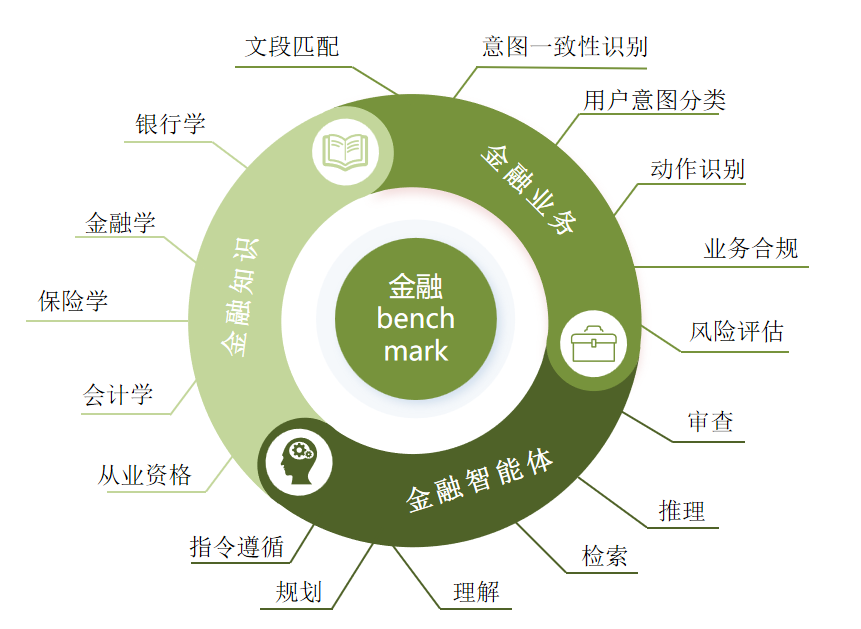

# <h1 align="center">FIN Benchmark</h1>
<div align="center">

  

</div>
FIN Benchmark 为中文金融领域的一项大模型能力评估基准，用于评估大语言模型的金融领域应用能力，包括金融知识储备和金融业务处理能力，评测数据由中山大学和招联金融人工智能研究中心共同开发。
<div align="center">

  <!-- [📃论文]()  -->

  [🌐网站](https://trustedgpt.pro/#/FIN)

</div>

<div align="center">
    
[中文](readme.md) | [English](readme_en.md)

</div>

## 📇目录
* [最新动态](#🌈最新动态)
* [评测集介绍](#😊评测集介绍)
* [评测榜单](#🏆评测榜单)
* [安装](#🛠️安装)
* [开始评测](#🛫️开始)
* [致谢和引用](#🤝致谢和引用)
##  🌈最新动态 
<!-- - [2025.××.××] 我们感谢××接受这篇论文，这反映了学术界的认可。
- [2025.××.××] 技术报告已发布。 -->
- [2024.××.××] 🎉🎉🎉正式发布 FINBenchmark 指南！🎉🎉🎉
##  😊评测集介绍
### 数据结构
数据集分为 3 个类别，共有 17 个数据集可供分析和研究。

- 金融知识：主要针对金融领域各个专业的知识考察，任务形式为选择题，涵盖以下类别：
  1. 银行学：银行业务、信贷政策、风险管理等。
  2. 金融学：考察金融市场、投资、公司理财等方面的知识。
  3. 保险学：涉及保险机制、保险产品和保险市场的知识。
  4. 会计学：会计原则、财务分析和报表理解。
  5. 从业资格：覆盖金融行业从业人员需要的法律法规和职业道德。
- 金融业务：主要基于实际业务场景的任务设计，评估任务多样，包含以下四个类别
  1. 对话摘要：概括实际业务对话内容。
  2. 意图识别：识别金融文本属于何种电销或催收意图。
  3. 动作识别：判断对话内容所属的动作类别。
  4. 业务合规：判断业务流程是否违反安全要求。
  5. 风险评估：评估模型根据用户信息评判潜在金融风险的能力。
  6. 文本匹配：评估模型对检索数据进行信息匹配的能力。
- 金融智能体：以问答题形式考察，包含以下六个类别
  1. 规划：模型在金融场景下根据目标制定API调用计划
  2. 推理：模型在金融场景下根据已完成的目标和计划推断当前目标
  3. 检索：模型在金融场景下根据当前目标选择合适API
  4. 理解：模型在金融场景下根据当前使用API推断其参数
  5. 指令跟随：模型在金融场景下遵循指定API调用格式
  6. 审查：模型在金融场景下判断API调用是否存在问题
  

### 详细信息
| 数据集名称              | 所属类别 | 来源                                      | 
|-------------------|-------------------|-----------------------------------------------|
|银行学|金融知识|银行学考试题库|
|金融学|金融知识|金融学考试题库|
|保险学|金融知识|保险学考试题库|
|会计学|金融知识|会计学考试题库|
|从业资格|金融知识|从业资格考试题库|
|对话摘要|金融业务|金融业务模拟|
|意图识别|金融业务|金融业务模拟|
|动作识别|金融业务|金融业务模拟|
|业务合规|金融业务|金融业务模拟|
|风险评估|金融业务|金融业务模拟|
|文本匹配|金融业务|金融业务模拟|
|规划|金融智能体|自构建数据集|
|推理|金融智能体|自构建数据集|
|理解|金融智能体|自构建数据集|
|审查|金融智能体|自构建数据集|
|检索|金融智能体|自构建数据集|
|指令遵循|金融智能体|自构建数据集|


##  🏆评测榜单
更多细节请前往 🏆 [金融大模型排行榜](https://trustedgpt.pro/#/FIN) 查看!

| 模型              | 金融知识           | 金融业务                                      | 金融智能体                             | 平均得分              | 排名
|-------------------|-------------------|-----------------------------------------------|----------------------------------|-------------------|------------------|
|zhilu2-70B|0.6417|0.8219|0.9368|0.8001|1|
|gpt-4-turbo-2024-04-09|0.5722|0.7937| 0.9176|0.7612|2|
|deepseek-chat-v2|0.6322|0.7364|0.9101|0.7596|3|
|Llama-3.1-405b|0.5975| 0.7615| 0.8840|0.7476|4|
|qwen2.5-72b-instruct|0.6904|0.6673| 0.8969|0.7439|5|
|gpt-4o-mini|0.5746|0.6931|0.8758|0.7257|6|
|qwen2.5-7b-instruct|0.6957|0.6287|0.7814|0.7148|7|
|gpt-3.5|0.5749|0.6844|0.9097|0.7047|8|
|glm-4-0520|0.5959|0.7267|0.8098|0.6996|9|
|Llama3-70B-Chinese-Chat|0.5423| 0.6807|0.8613|0.6948|10|
|Tongyi-Finance-14B|0.5146|0.5882|0.8020|0.6153|11|
|Llama3-XuanYuan3-70B-Chat|0.4487|0.4364|0.7899|0.6089|12|
|zhilu2-8B|0.4898|0.4882|0.6366|0.5382|13|
|XuanYuan-6B-Chat|0.4401|0.5293|0.5932|0.5007|14|
|Finance-llama3_1_8B_instruct|0.4072|0.3941| 0.5665|0.4700|15|
|chinese-alpaca-2-13b|0.3865|0.4686|0.6211|0.4672|16|
|DISC-FinLLM（13B）|0.3753|0.2864|0.5075|0.4235|17|
|llama3-8b-chinese-instruct-v3|0.4269|0.3877|0.3159|0.3431|18|
|zhilu-1-instruct|0.3696|0.3832|0.0978|0.2835|19|


##  🛠️安装

```bash
$ cd T-Eval
$ pip install -r requirements.txt
$ cd lagent && pip install -e .
```

##  🛫️开始评测
*此处是除了金融智能体之外的评测结果生成的教程，金融智能体评测请参考T-Eval/README.md*
### 本地模型

执行下面代码生成结果：

```
python generate_code.py --model_path MODEL_PATH
                        --do_test
                        [--model_template MODEL_TEMPLATE]
                        [--peft_model_path PEFT_MODEL_PATH]
                        [--task TASK]
                        [--gpus GPUS]
                        [--batch BATCH]
                        [--use_vllm]
                        [--cot]
                        [--num_few_shot NUM_FEW_SHOT]
                        [--output_path OUTPUT_PATH]
                        [--verbose]
```

参数说明：

`model_path`: 模型文件夹路径，必需

`model_template`: chat模型使用的模板，可选`default`、`llama2`、`llama3`，默认为`llama3`

`peft_model_path`: 模型的lora文件夹路径

`task`: 评测任务，可选一级/二级任务名，如`financial_knowledge`或`finance_single`，默认为所有任务

`do_test`: 使用测试集

`gpus`: 指定使用的GPU，如`0,1,2,3`，默认使用所有

`batch`: 指定batch generate数

`use_vllm`: 使用vllm进行生成

`cot`: 使用思维链

`num_few_shot`: 推理时使用的例子数，最大为5，默认0

`output_path`: 生成结果的输出路径

`verbose`: 推理时在终端实时输出结果

### api模型

执行下面代码生成结果：

```
python generate_code_api.py --model_name MODEL_NAME
                            --model_api MODEL_API
                            --do_test
                            [--model_url MODEL_URL]
                            [--task TASK]
                            [--batch BATCH]
                            [--cot]
                            [--num_few_shot NUM_FEW_SHOT]
                            [--test_cases TEST_CASES]
                            [--output_path OUTPUT_PATH]
                            [--verbose]
```

参数说明：

`model_name`: 模型名称，必需

`model_api`: 模型api，必需

`model_url`: 模型base_api，默认使用chatgpt官方api

其余参数与`generate_code.py`一致。

### ✉️提交

<!-- ## 💳 License

This project is released under the Apache 2.0 [license](./LICENSE). -->
我们有 17 个数据集，并且期望提交遵循以下命名规范：
```
Primary Directory (Model Name)
├── accounting_multiple.json
├── accounting_single.json
├── action_recognition.json
├── banking_multiple.json
├── banking_single.json
├── business_compliance.json
├── dialogue_summarization.json
├── distress_prediction.json
├── emotion_transfer
├── finance_multiple
├── finance_single
├── insurance_multiple
├── insurance_single
├── intent_recognition
├── qualification_multiple
├── qualification_single
├── question_answering
├── semantic_similarity
├── text_matching
└── teval_output
   └── instruct
   └── plan
   └── reason
   └── retrieve
   └── review
   └── understand
   └── instruct.json
   └── plan.json
   └── reason.json
   └── result.json
   └── retrieve.json
   └── review.json
   └── understand.json
```
你需要将文件提交为压缩包格式。例如，gemini-1.5-pro.zip。


1. 您需要点击“选择文件”按钮，并从本地设备中选择压缩文件。

2. 点击“上传并处理”按钮；通常需要 30-60 分钟来评分提交内容。

3. 处理完成后，您可以点击“下载评估结果”按钮下载评估结果。

4. 您可以将成绩发送至 691154380@qq.com 用于宣传目的。

##  🤝致谢和引用
我们衷心感谢 招联消费金融股份有限公司 在该项目中提供的巨大支持！🎉🎉🎉

此外，我们感谢所有参与该项目的成员！

如果您认为我们的数据集有帮助的话，请按照以下格式引用我们的论文
```

```
