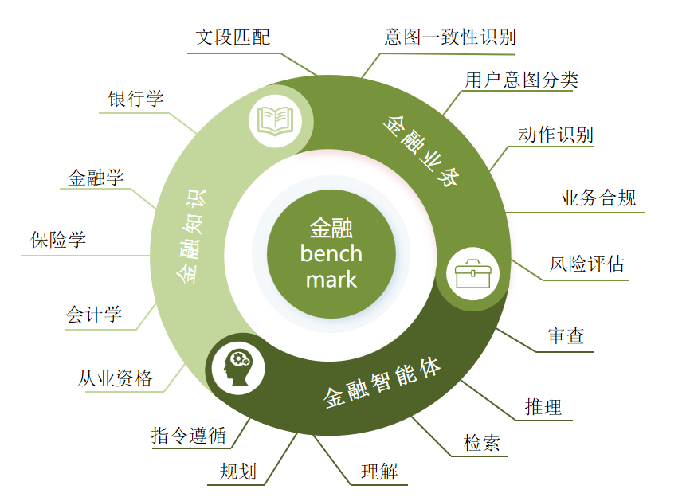

# <h1 align="center">FIN Benchmark</h1>
<div align="center">

  

</div>
The FIN Benchmark is a large model evaluation benchmark for the Chinese financial domain, designed to assess the application capabilities of large language models in the financial field, including financial knowledge reserves and financial services processing capabilities. The evaluation data was jointly developed by Sun Yat-sen University and the Artificial Intelligence Research Center of Zhaolian Financial.
<div align="center">

  <!-- [📃Paper]()  -->

  [🌐Website](https://trustedgpt.pro/#/FIN)

</div>

<div align="center">
    
[Chinese](readme.md) | [English](readme_en.md)

</div>

## 📇Table of Contents
* [Latest Updates](#🌈latest-updates)
* [Introduction to the Evaluation Set](#😊introduction-to-the-evaluation-set)
* [Leaderboard](#🏆leaderboard)
* [Installation](#🛠️installation)
* [Start Evaluation](#🛫️starting-evaluation)
* [Acknowledgments and Citation](#🤝acknowledgments-and-citations)
##  🌈Latest Updates 
<!-- - [2025.××.××] We are grateful to ×× for accepting this paper, which reflects academic recognition.
- [2025.××.××] The technical report has been released. -->
- [2024.××.××] 🎉🎉🎉Officially released the FINBenchmark Guide!🎉🎉🎉
##  😊Introduction to the Evaluation Set
### Data Structure
The dataset is divided into 3 categories, with a total of 17 datasets available for analysis and research.

- Financial Knowledge: Mainly examines professional knowledge in various fields of finance, with tasks in the form of multiple-choice questions, covering the following categories:
  1. Banking: Banking operations, credit policies, risk management, etc.
  2. Finance: Knowledge of financial markets, investments, corporate finance, etc.
  3. Insurance: Knowledge of insurance mechanisms, insurance products, and insurance markets.
  4. Accounting: Accounting principles, financial analysis, and financial statement comprehension.
  5. Professional Qualifications: Laws, regulations, and professional ethics required for financial industry practitioners.
- Financial services: Tasks are designed based on actual business scenarios, with diverse evaluation tasks, including the following six categories:
  1. Intent Consistency Identification: Analyze the core objectives, operational paths, and information completeness of two texts to determine whether they express the same intent under a specific topic.
  2. User Intent Classification: Identify whether a financial text belongs to a specific telemarketing or debt collection intent.
  3. Business Compliance: Determine whether an agent's response violates security requirements.
  4. Action Recognition: Classify dialogue content into specific action categories.
  5. Text Matching: Evaluate the model's ability to match retrieved data with relevant information.
  6. Risk Assessment: Assess the model's capability to evaluate potential financial risks based on user information.
- Financial Agency: Examined in the form of Q&A, including the following six categories:
  1. Plan: The model formulates API call plans based on goals in financial scenarios.
  2. Reason: The model infers current goals based on completed goals and plans in financial scenarios.
  3. Retrieve: The model selects appropriate APIs based on current goals in financial scenarios.
  4. Understand: The model infers parameters based on the currently used API in financial scenarios.
  5. Instruct: The model follows specified API call formats in financial scenarios.
  6. Review: The model judges whether API calls have issues in financial scenarios.

### Detailed Information
| Dataset Name              | Category | Source                                      | 
|-------------------|-------------------|-----------------------------------------------|
|Banking|Financial Knowledge|Banking Exam Question Bank|
|Finance|Financial Knowledge|Finance Exam Question Bank|
|Insurance|Financial Knowledge|Insurance Exam Question Bank|
|Accounting|Financial Knowledge|Accounting Exam Question Bank|
|Professional Qualifications|Financial Knowledge|Professional Qualification Exam Question Bank|
|User Intent Classification|Financial services|Financial services Simulation|
|Intent Consistency Identification|Financial services|Financial services Simulation|
|Action Recognition|Financial services|Financial services Simulation|
|Business Compliance|Financial services|Financial services Simulation|
|Risk Assessment|Financial services|Financial services Simulation|
|Text Matching|Financial services|Financial services Simulation|
|Plan|Financial Agency|Self-constructed Dataset|
|Reason|Financial Agency|Self-constructed Dataset|
|Understand|Financial Agency|Self-constructed Dataset|
|Review|Financial Agency|Self-constructed Dataset|
|Retrieve|Financial Agency|Self-constructed Dataset|
|Instruct|Financial Agency|Self-constructed Dataset|


##  🏆Leaderboard
For more details, please visit 🏆 [Financial Large Model Leaderboard](https://trustedgpt.pro/#/FIN)!

| Model              | Financial Knowledge           | Financial Services                                      | Financial Agency                             | Average Score              | Rank
|-------------------|-------------------|-----------------------------------------------|----------------------------------|-------------------|------------------|
|zhilu2-70B|0.6417|0.8219|0.9368|0.8001|1|
|gpt-4-turbo-2024-04-09|0.5722|0.7937| 0.9176|0.7612|2|
|deepseek-chat-v3|0.6322|0.7364|0.9101|0.7596|3|
|Llama-3.1-405b|0.5975| 0.7615| 0.8840|0.7476|4|
|qwen2.5-72b-instruct|0.6904|0.6673| 0.8969|0.7439|5|
|gpt-4o-mini|0.5746|0.6931|0.8758|0.7257|6|
|qwen2.5-7b-instruct|0.6957|0.6287|0.7814|0.7148|7|
|gpt-3.5|0.5749|0.6844|0.9097|0.7047|8|
|glm-4-0520|0.5959|0.7267|0.8098|0.6996|9|
|Llama3-70B-Chinese-Chat|0.5423| 0.6807|0.8613|0.6948|10|
|Tongyi-Finance-14B|0.5146|0.5882|0.8020|0.6153|11|
|Llama3-XuanYuan3-70B-Chat|0.4487|0.4364|0.7899|0.6089|12|
|zhilu2-8B|0.4898|0.4882|0.6366|0.5382|13|
|XuanYuan-6B-Chat|0.4401|0.5293|0.5932|0.5007|14|
|Finance-llama3_1_8B_instruct|0.4072|0.3941| 0.5665|0.4700|15|
|chinese-alpaca-2-13b|0.3865|0.4686|0.6211|0.4672|16|
|DISC-FinLLM（13B）|0.3753|0.2864|0.5075|0.4235|17|
|llama3-8b-chinese-instruct-v3|0.4269|0.3877|0.3159|0.3431|18|
|zhilu-1-instruct|0.3696|0.3832|0.0978|0.2835|19|
##  🛠️Installation

```bash
$ cd T-Eval
$ pip install -r requirements.txt
$ cd lagent && pip install -e .
```

## 🛫️Starting Evaluation
This section covers evaluations except for financial Agency. For financial agent evaluations, please refer to T-Eval/README.md.

### Local Models
Run the following code to generate results:
```
python generate_code.py --model_path MODEL_PATH
                        --do_test
                        [--model_template MODEL_TEMPLATE]
                        [--peft_model_path PEFT_MODEL_PATH]
                        [--task TASK]
                        [--gpus GPUS]
                        [--batch BATCH]
                        [--use_vllm]
                        [--cot]
                        [--num_few_shot NUM_FEW_SHOT]
                        [--output_path OUTPUT_PATH]
                        [--verbose]
```

Parameter Descriptions:

`model_path`: Path to the model folder (required).

`model_template`: Template used by the chat model. Optional: `default`, `llama2`, `llama3`. Defaults to `llama3`.

`peft_model_path`: Path to the model's lora folder.

`task`: Evaluation task. Optional primary/secondary task names, such as `financial_knowledge` or `finance_single`. Defaults to all tasks.

`do_test`: Use the test set.

`gpus`: Specify the GPUs to use, e.g., `0,1,2,3`. Defaults to using all available GPUs.

`batch`: Specify the batch size for generation.

`use_vllm`: Use vllm for generation.

`cot`: Use chain of thought.

`num_few_shot`: Number of examples to use during inference, up to 5. Defaults to 0.

`output_path`: Path to output the generated results.

`verbose`: Output results in real-time to the terminal during inference.

### API Models
Run the following code to generate results:
```
python generate_code_api.py --model_name MODEL_NAME
                            --model_api MODEL_API
                            --do_test
                            [--model_url MODEL_URL]
                            [--task TASK]
                            [--batch BATCH]
                            [--cot]
                            [--num_few_shot NUM_FEW_SHOT]
                            [--test_cases TEST_CASES]
                            [--output_path OUTPUT_PATH]
                            [--verbose]
```

Parameter Descriptions:

`model_name`: Name of the model (required).

`model_api`: API KEY of the model (required).

`model_url`: Base URL of the model. Defaults to the official ChatGPT API.

Other parameters are consistent with `generate_code.py`.

### ✉️Submission
Our evaluation code requires the following data format:
```
Primary Directory (Model Name)
├── accounting_multiple.json
├── accounting_single.json
├── action_recognition.json
├── banking_multiple.json
├── banking_single.json
├── business_compliance.json
├── dialogue_summarization.json
├── distress_prediction.json
├── emotion_transfer
├── finance_multiple
├── finance_single
├── insurance_multiple
├── insurance_single
├── intent_recognition
├── qualification_multiple
├── qualification_single
├── question_answering
├── semantic_similarity
├── text_matching
└── teval_output
   └── instruct
   └── plan
   └── reason
   └── retrieve
   └── review
   └── understand
   └── instruct.json
   └── plan.json
   └── reason.json
   └── result.json
   └── retrieve.json
   └── review.json
   └── understand.json
```
Please submit your files in a compressed package, such as gemini-1.5-pro.zip, and send it to jizh3@mail2.sysu.edu.cn. After the evaluation process is complete, the results will be published on GitHub.

##  🤝Acknowledgments and Citations
We sincerely appreciate the substantial support provided by Merchants Union Consumer Finance Company Limit in this project! 🎉🎉🎉

Additionally, we are grateful to all members who participated in this project!

If you find our datasets helpful, please cite our paper in the following format:
